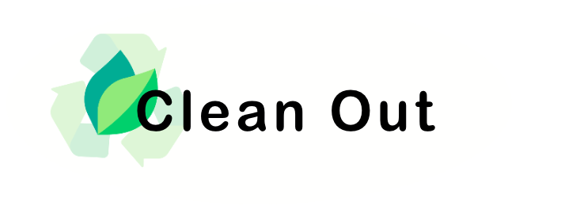
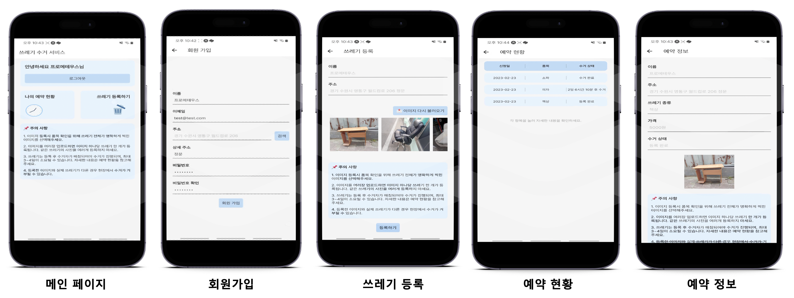
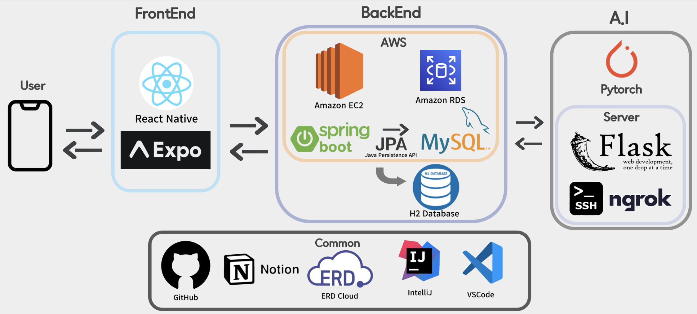

# Introduction
클린아웃은 대형 폐기물을 쉽게 수거할 수 있는 서비스입니다.
폐기할 가구와 전자기기 등 대형 쓰레기를 사진 찍으면 머신러닝을 통해 각 물품에 대한 부가 금액을 책정합니다.

다소 번거로운 기존 스티커 정책을 대체할 수 있는 서비스로, 쓰레기 등록부터 수거자 매칭, 수거 예약과 방문 수거까지 해결할 수 있는 솔루션입니다.
기존의 지자체에서 운영하는 쓰레기 수거 서비스를 대체할 수 있는 G2B(Government To Business)의 특성을 띠는 서비스입니다.

# Members
| 박원기 | 전민규  | 최윤서  | 이유환 | 정두원|                                                        
| :----------------------------------------------------------: | :----------------------------------------------------------: | :----------------------------------------------------------: | :----------------------------------------------------------: | :----------------------------------------------------------: |
| </img> | </img> | </img> | </img> | </img> | 
|  |  | |  |  |

### Contribution
- [`박원기`](https://github.com/kalelpark) &nbsp; ML Server • DL 
- [`전민규`](https://github.com/Mango-Juice) &nbsp; Frontend • UI/UX
- [`최윤서`](https://github.com/govldbstj) &nbsp; Frontend  • PM
- [`이유환`](https://github.com/320Hwany) &nbsp; Backend • Server • DB 
- [`정두원`](https://github.com/D-w-nJ) &nbsp; Backend • DB • Server 

# Overview

# System architecture

